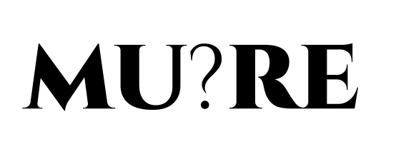

<div align="center">

</div>

# A rule engine for MIU System

<div align="left">
<div>     
</div>

</div>

### Introduction

Mure is rule engine, more specifically a string term rewriting system or more generally a production rule system, but the name **`mure`** stands for `mu rule engine` and has been chosen due to the abbreviation it leads to, the word **mure** and its meaning is very much what Dr. Hofstadter is trying to illustrate using the MU puzzle in the book. The distinction of **`reasoning in the system`** and **`reasoning about the system`** and the limitation of expressing some propositions or proofs from within the system (trapped/constrained from the foundational formalisms or axioms of the system) but as humans, we have meta-reasoning skills which are activated as soon we start to get a hint from getting stuck from reasoning inside the system and we start to think and analyze the system as a whole and in that effort we figure out the limitation of the system.

The MIU System is a formal system where in that system there are some valid symbols i.e. **`M`**, **`I`** and **`U`** and using these fundamental symbols you can combine them and create strings in the system. MU System also defines some rules for string transformations, these rules are only applicable if the given string statisfies the rule's neccesary precondition which is essentially a pattern which has occur in the string and only then you can apply and transform it something similar to the rules of inference of Propsitional Logic where the conclusion is proved or derived on basis of the statisfiability of the premise. The rules are given below -

| Rule no. |            Formal Rule           |   Example   |
|----------|:--------------------------------:|:-----------:|
|     1    |     *x* **`I`** ⟶ *x* **`IU`**     |   **`MI`** ⟶ **`MIU`**  |
|     2    |     **`M`** *x* ⟶ **`M`** *xx*     |   **`MI`** ⟶ **`MII`**  |
|     3    |  *x* **`III`** *y* ⟶ *x* **`U`** *y* | **`MIIIU`** ⟶ **`MUU`** |
|     4    |       *x* **`UU`** *y* ⟶ *xy*      | **`MIUUI`** ⟶ **`MII`** |

This library helps you work with the MIU System where you can check if the the given string is valid, check which rules can be applied, apply transformations etc. This project or the initial source code was conceived a couple of years a ago when I was trying to solve the MU Puzzle (Challange in the GEB book), the problem statement of the puzzle is given an initial string or axiom **`MI`** can we derive using any number of transformations the string **`MU`**. I was stuck on the puzzle and trying to derive it by hand on paper then got fed and decided to write a bruteforce algorithm which would run and help me get the rule application order which would yield the answer. Then I eventually found out by giving up and found that it was not possible derive, explaination is provided in the GEB book but if you don't have the book you can refer to a very good and concise explaination on [Wikipedia](https://en.wikipedia.org/wiki/MU_puzzle). Even though you can't derive the string **`MU`** from the given preconditions but still MIU System is a very interesting to work and explore using this library and find new theorems so I decided to publish this library as a package so other people can build on and reuse this work. 

But you may ask what's the point of this? Dr. Hofstadter is a proponent of a theory of cognitive science as he calls it **`Analogy as the Core of Cognition`** where he proposes that we humans at the core of our cognition use analogy making to learn and correlate things consciously and unconsciously. So MIU System serves as tool for us to learn a simple but profound conclusions about formal axiomatic systems, their limitations and their ability to find out about the limitations about the system from within the framework of the system. So these concepts which we learn through MIU System get transfered directly to and serve as an analogue to the ideas and problems, in the context of Mathematical Logic, Foundation of Mathematics and Gödel's incompleteness theorems, for more details and how this works out you can pick up and read the book **`Gödel, Escher, Bach: an Eternal Golden Braid`** by **`Douglas Hofstadter`**. 

### Installation

#### `NPM`
```javascript
npm i mure
```

#### `CDN`
```html
<script src="https://unpkg.com/mure"></script>
```

### API Reference

#### `Importing Mure`
When you import the package you will get an object which includes all the functions needed for working with the **MIU System**.
```javascript
let mure = require("mure");
// or only include relevant functions
let { isValid, applyRule } = require("mure");
```

#### `mure.isValid(str: String) -> Boolean`
This function helps you check whether the string is valid within the MIU System. Note: Any function provided by the library is **case insensitive** so both the input strings `mUi` and `MUI` will yield `true`.
```javascript
let mure = require("mure");

console.log(mure.isValid("dslkfjl")); // -> Will print false
console.log(mure.isValid("MII")); // -> Will print true
```
